# OrderPilot — AI Sales Operating System for WhatsApp-First Businesses

> **Route inbound WhatsApp orders through AI extraction, quotation review, invoice delivery, and follow-up automation — without leaving your sales dashboard.**

---

## Table of Contents

- [What is OrderPilot?](#what-is-orderpilot)
- [Live System Flow](#live-system-flow)
- [Screenshots](#screenshots)
- [Architecture](#architecture)
- [Tech Stack](#tech-stack)
- [Database Schema](#database-schema)
- [n8n Workflows](#n8n-workflows)
- [Twilio WhatsApp Integration](#twilio-whatsapp-integration)
- [Supabase Edge Functions](#supabase-edge-functions)
- [Google Sheets Sync](#google-sheets-sync)
- [How to Run](#how-to-run)
- [Environment Variables](#environment-variables)

---

## What is OrderPilot?

OrderPilot is an **AI-powered WhatsApp Sales & Order Management Platform** built for businesses that receive orders via WhatsApp. It automates the entire sales workflow — from the moment a customer sends a message to the moment an invoice PDF lands in their WhatsApp chat.

### Core Capabilities

- **AI Order Extraction** — Gemini AI reads every inbound WhatsApp message (text or voice note) and extracts products, quantities, urgency, and delivery details automatically
- **Auto Quotation** — Draft quotations are generated instantly, priced against your live product catalog
- **One-Click Invoice** — On approval, a PDF invoice is generated, stored in Supabase Storage, and delivered to the customer via WhatsApp
- **Follow-up Automation** — n8n workflows run every 15 minutes to nudge unapproved quotations and overdue invoices
- **Google Sheets Sync** — Every quotation, order, and invoice mirrors to Google Sheets so non-technical finance staff never need to open the dashboard
- **Live Sales Dashboard** — React dashboard gives the sales team full visibility: Inbox, Quotations, Customers, Products, Invoices, Follow-ups, Analytics

---

## Live System Flow

```
Customer sends WhatsApp message or voice note
              │
              ▼
     Twilio WhatsApp API
              │
        Webhook (HTTPS)
              │
              ▼
  Supabase Edge Function (twilio-webhook)
     • Upserts customer record
     • Saves inbound message to DB
     • Forwards payload to n8n
              │
              ▼
       n8n Intake Workflow
     • Checks if voice note → Whisper transcription
     • Sends text to Gemini AI for extraction
     • Parses: products, quantities, urgency, delivery
     • Creates quotation draft + line items
     • Prices against products catalog
     • Sends quotation summary reply via Twilio
     • Creates follow-up reminder row
              │
              ▼
   Sales Team reviews in Dashboard
     • Inbox shows all inbound messages
     • Quotations page shows draft with line items
     • Sales rep clicks "Approve"
              │
              ▼
   n8n Approval Workflow
     • Fetches quotation + customer data
     • Triggers PDF generation Edge Function
     • Stores PDF in Supabase Storage
     • Sends invoice PDF link via Twilio WhatsApp
     • Updates quotation status → invoiced
     • Syncs invoice row to Google Sheets
              │
              ▼
   Dashboard + Google Sheets stay in sync
     • Analytics: revenue, draft quotes, open follow-ups
     • Google Sheets: catalog, quotations, invoices
```

---

## Screenshots

### Sign In
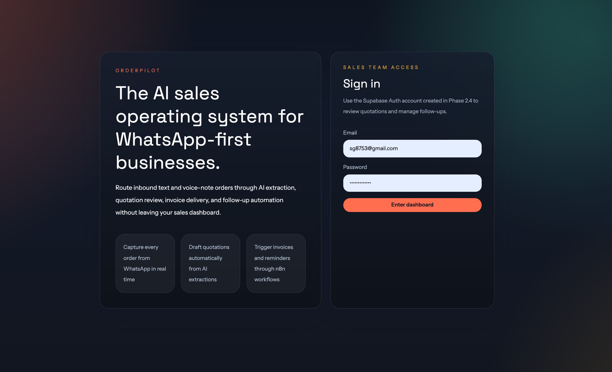

### Inbox — Live WhatsApp Order Intake
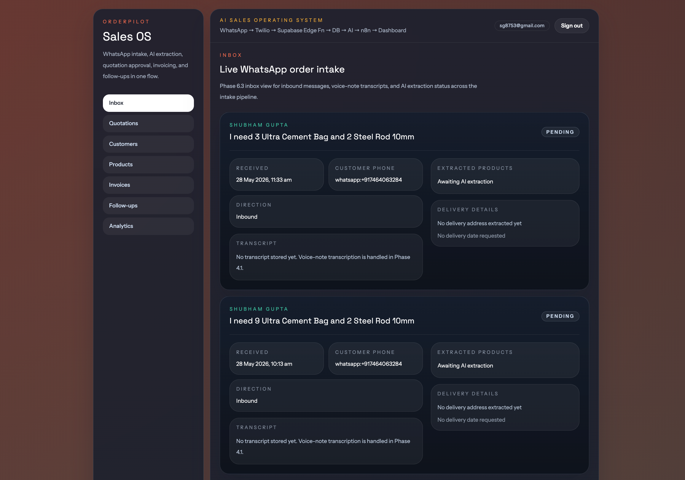
> Every inbound WhatsApp message appears here with AI extraction status, transcript (for voice notes), and delivery details.

### Quotations — Review, Approve, and Trigger Delivery
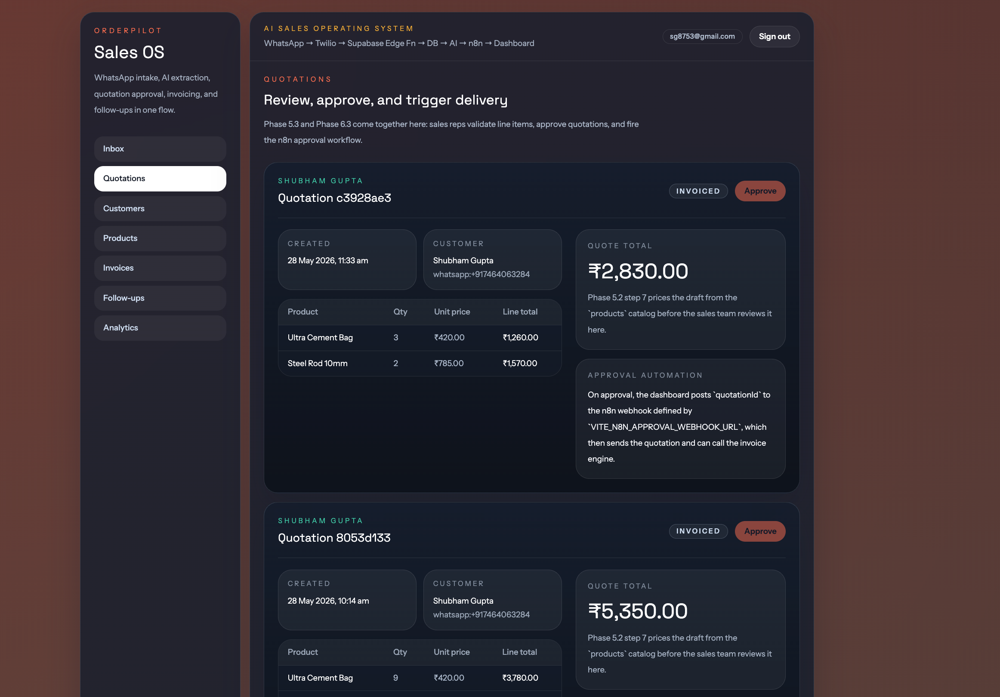
> Sales reps validate line items, approve quotations, and fire the n8n approval workflow with one click.

### Customers
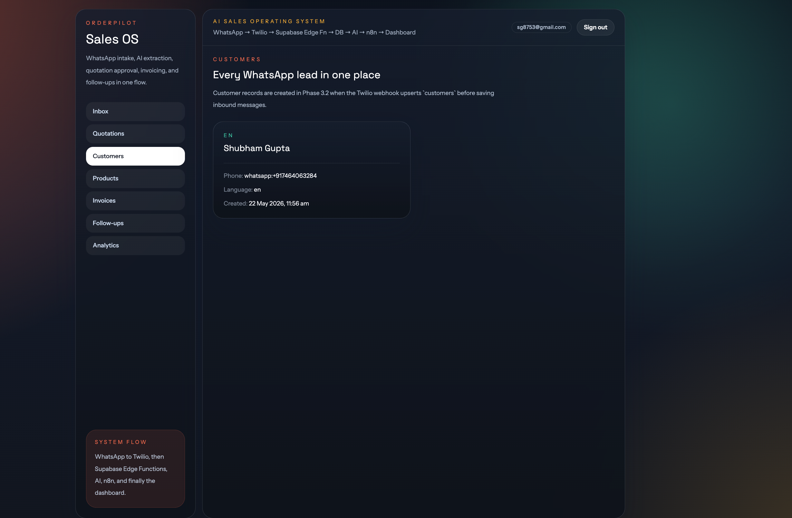
> Customer records are auto-created when Twilio webhook upserts the `customers` table on first message.

### Products — Catalog Editor
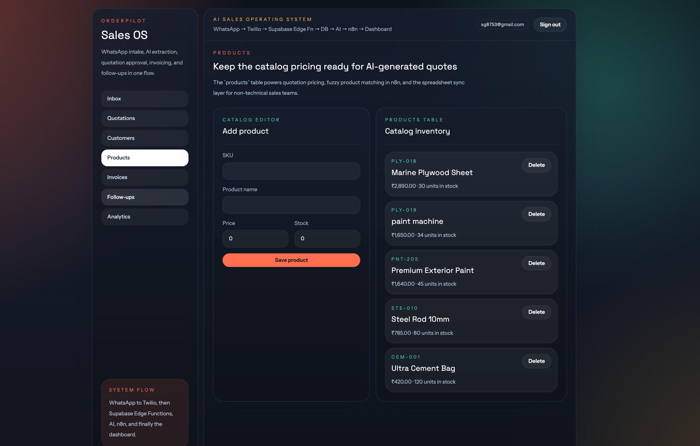
> Add and manage your product catalog. Prices here power all AI-generated quotations.

### Invoices — Track Delivery and Collection
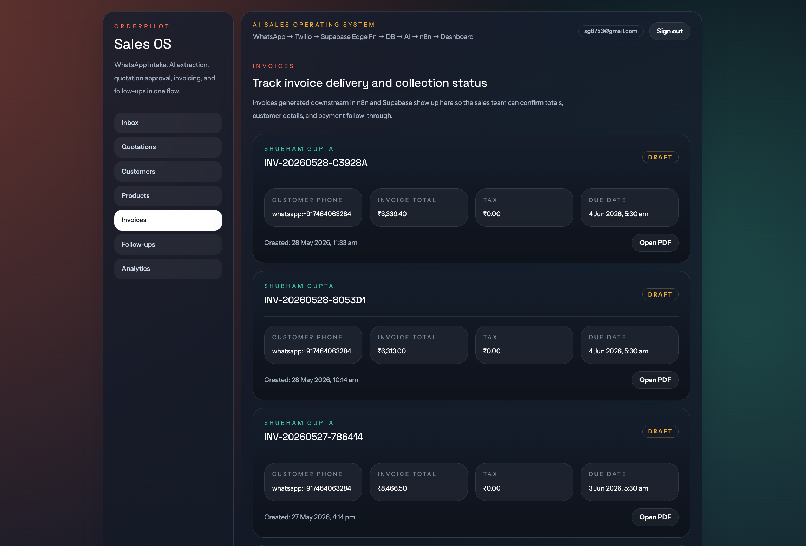
> Auto-generated invoices with PDF download. Status tracked: draft → sent → paid → overdue.

### Invoice PDF
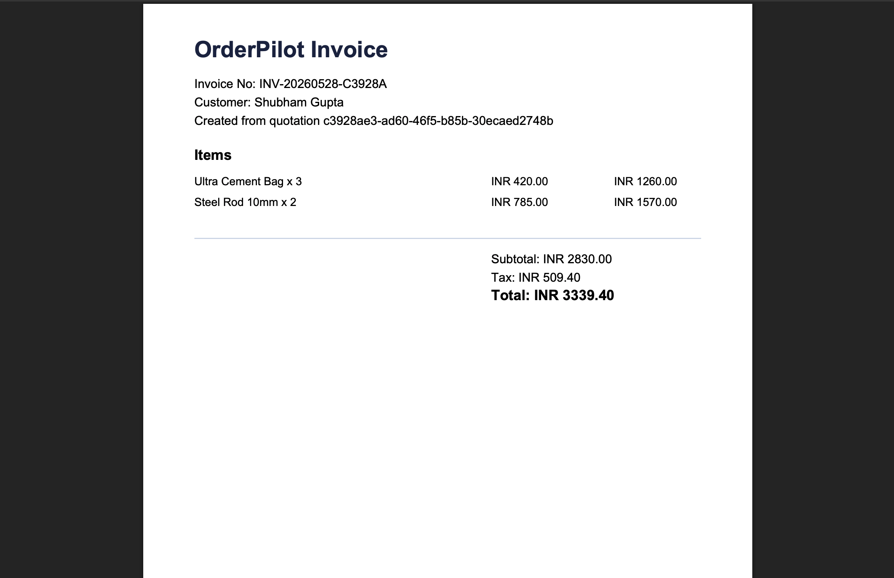
> Clean, professional PDF generated by Supabase Edge Function and delivered to customer via WhatsApp.

### Follow-ups — Stay Ahead of Unapproved Quotes
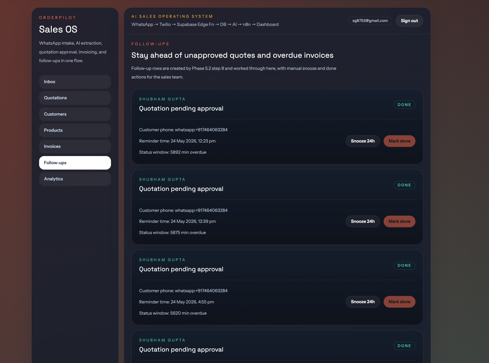
> Automated nudges for pending quotations and overdue invoices. Snooze or mark done from the dashboard.

### Analytics — Full Sales Workflow Visibility
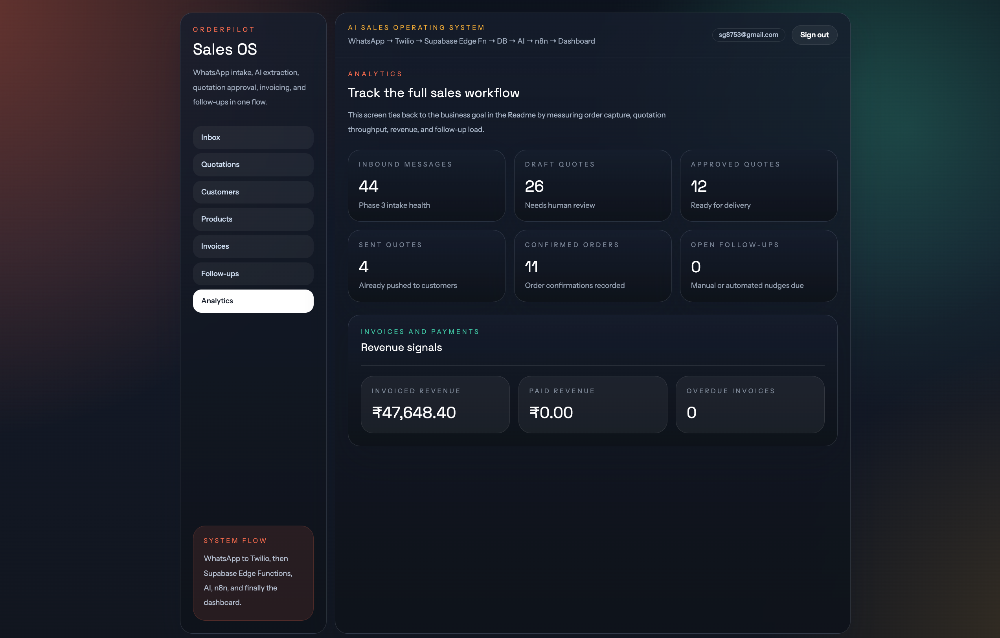
> Track inbound messages, draft quotes, approved quotes, confirmed orders, invoiced revenue, and paid revenue in one view.

### Google Sheets Sync
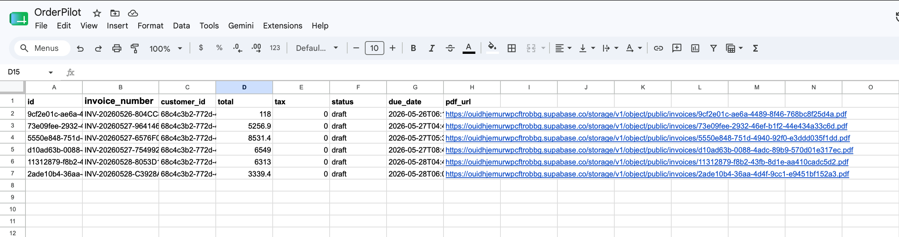
> Every invoice auto-mirrors to Google Sheets with invoice number, total, status, due date, and PDF link.

---

## Architecture

```
+----------------------+        +----------------------+
|   WhatsApp Customer  | <----> |   Twilio WhatsApp    |
+----------------------+        +----------------------+
                                         │
                                  Webhook (HTTPS)
                                         │
                                         ▼
                                +--------------------+
                                |  Supabase Edge Fn  |
                                |  (twilio-webhook)  |
                                +--------------------+
                                         │
                        +----------------+----------------+
                        │                                 │
                        ▼                                 ▼
              +-------------------+          +----------------------+
              |    Supabase DB    |          |      AI Layer        |
              |  (Postgres + RLS) |          |  Gemini AI (primary) |
              |  + Storage (PDFs) |          |  OpenAI Whisper      |
              +-------------------+          +----------------------+
                        │                                 │
                        +---------------------------------+
                                         │
                                         ▼
                                +--------------------+
                                |    n8n Workflows   |
                                |   (orchestration)  |
                                +--------------------+
                                         │
        +------------+----------+--------+-----------+------------+
        │            │          │                    │            │
        ▼            ▼          ▼                    ▼            ▼
+------------+ +----------+ +----------+    +----------+ +----------+
| Twilio     | | Invoice  | | Google   |    | Follow-up| | React +  |
| (reply +   | | Engine   | | Sheets   |    | Scheduler| | Tailwind |
|  invoice)  | | Edge Fn  | | 2-way    |    | Every    | | Dashboard|
|            | | PDF →    | | sync     |    | 15 min   | | (Vercel) |
|            | | Storage  | | catalog, |    |          | |          |
|            | |          | | quotes,  |    |          | |          |
|            | |          | | invoices |    |          | |          |
+------------+ +----------+ +----------+    +----------+ +----------+
```

---

## Tech Stack

| Layer | Technology | Purpose |
|---|---|---|
| **Frontend** | React + Vite + Tailwind CSS | Sales dashboard UI |
| **Backend / DB** | Supabase (PostgreSQL) | Database, Auth, Storage, Edge Functions |
| **Auth** | Supabase Auth + RLS | JWT auth; row-level security for multi-tenant data |
| **WhatsApp** | Twilio WhatsApp Business API | Inbound/outbound WhatsApp messaging |
| **AI Extraction** | Google Gemini (primary) | Product, quantity, urgency extraction from messages |
| **Voice Transcription** | OpenAI Whisper API | Voice note → text transcription |
| **Automation** | n8n Cloud | Workflow orchestration across all services |
| **Spreadsheet Sync** | Google Sheets API v4 | Two-way sync for non-technical sales/finance staff |
| **Invoicing** | Supabase Edge Function + pdf-lib | PDF generation, Storage upload, WhatsApp delivery |
| **Deployment** | Vercel (frontend) + Supabase + n8n Cloud | Production-ready, zero-ops stack |

---

## Database Schema

All tables are protected by **Row Level Security (RLS)** in Supabase.

| Table | Purpose |
|---|---|
| `customers` | WhatsApp phone, name, language, segment |
| `messages` | Raw inbound/outbound message log (text + media URL) |
| `transcriptions` | Voice note → text results from Whisper |
| `ai_extractions` | Products, qty, urgency, delivery extracted by Gemini |
| `products` | Product catalog (SKU, name, price, stock) |
| `quotations` | Draft and approved quotations |
| `quotation_items` | Line items linked to a quotation |
| `orders` | Confirmed orders |
| `invoices` | Auto-generated invoices (number, totals, tax, status, due date, PDF URL) |
| `invoice_items` | Invoice line items (product, qty, unit price, tax, line total) |
| `payments` | Recorded payments against invoices |
| `follow_ups` | Scheduled reminders and nudges |
| `sheet_sync_log` | Sync timestamps and row hashes per Google Sheet |
| `users` | Sales team accounts via Supabase Auth |
| `audit_log` | Who approved or edited what, and when |

### Supabase Tables (Live)
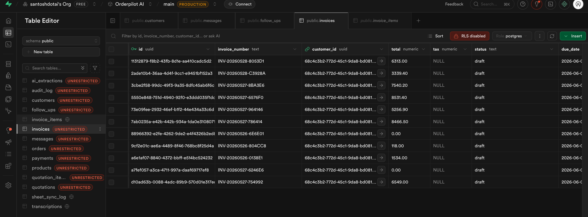

---

## n8n Workflows

### Workflow 1 — WhatsApp Intake & AI Quotation
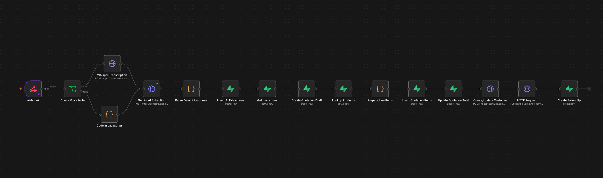

**Nodes:**
1. **Webhook** — Receives payload from `twilio-webhook` Edge Function
2. **Check Voice Note** — Routes to Whisper if media, else direct to Gemini
3. **Whisper Transcription** — Transcribes voice notes via OpenAI API
4. **Gemini AI Extraction** — Extracts products, quantities, urgency, delivery
5. **Parse Gemini Response** — Cleans and structures AI output
6. **Insert AI Extractions** — Saves extraction to Supabase
7. **Get Many Rows** — Fetches matching products from catalog
8. **Create Quotation Draft** — Creates quotation record in Supabase
9. **Lookup Products** — Prices line items against catalog
10. **Prepare Line Items** — Calculates totals
11. **Insert Quotation Items** — Saves line items to Supabase
12. **Update Quotation Total** — Updates final total on quotation
13. **Create/Update Customer** — Upserts customer record
14. **HTTP Request** — Sends quotation summary reply via Twilio
15. **Create Follow Up** — Creates follow-up reminder row

---

### Workflow 2 — Quotation Approval & Invoice Generation
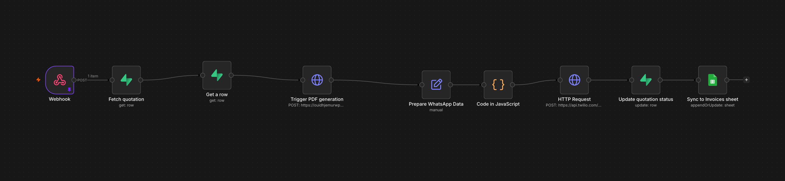

**Nodes:**
1. **Webhook** — Triggered by dashboard Approve button
2. **Fetch Quotation** — Gets full quotation data from Supabase
3. **Get a Row** — Fetches customer details
4. **Trigger PDF Generation** — Calls Supabase Edge Function to render PDF
5. **Prepare WhatsApp Data** — Builds Twilio message payload
6. **Code in JavaScript** — Formats invoice message with template variables
7. **HTTP Request** — Sends invoice PDF link via Twilio WhatsApp
8. **Update Quotation Status** — Marks quotation as invoiced
9. **Sync to Invoices Sheet** — Appends/updates invoice row in Google Sheets

---

### Workflow 3 — Follow-up Automation (Every 15 Minutes)
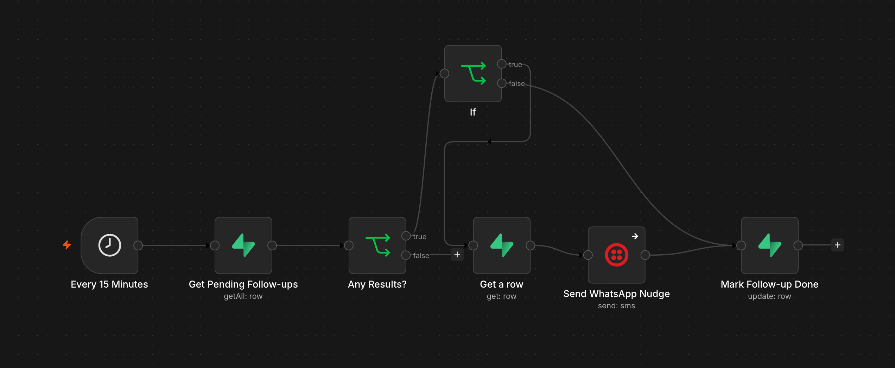

**Nodes:**
1. **Every 15 Minutes** — Cron trigger
2. **Get Pending Follow-ups** — Fetches overdue follow-up rows from Supabase
3. **Any Results?** — If/else branch: skip if no pending items
4. **Get a Row** — Fetches customer details for each follow-up
5. **Send WhatsApp Nudge** — Sends reminder message via Twilio
6. **Mark Follow-up Done** — Updates follow-up status in Supabase

---

## Twilio WhatsApp Integration

### Incoming Messages (Twilio Monitor)
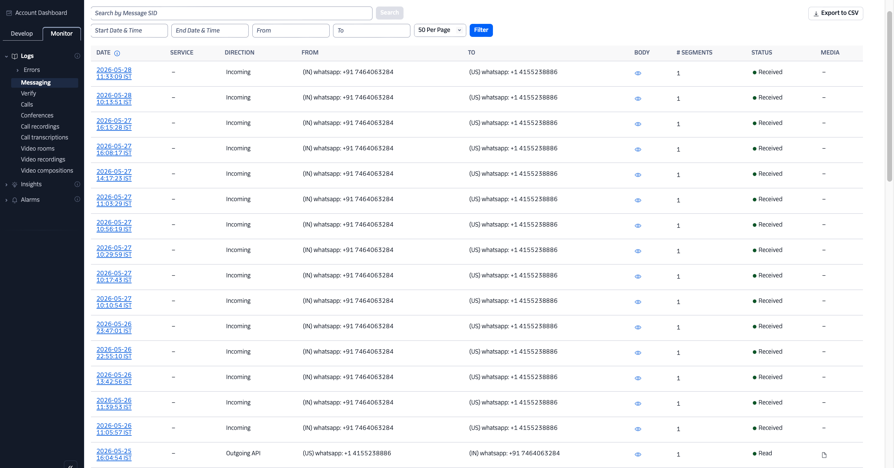

All inbound WhatsApp messages from customers are logged in Twilio Monitor with direction, status, and message SID.

### WhatsApp Content Template
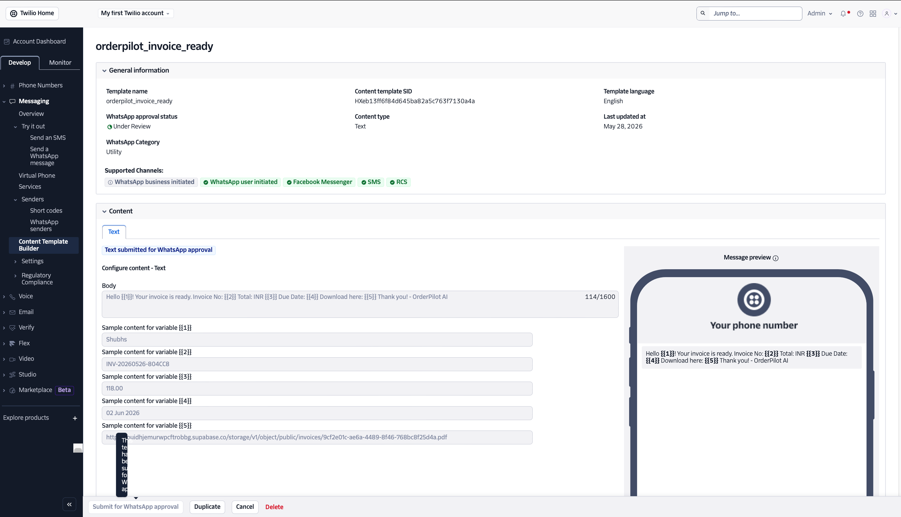

The `orderpilot_invoice_ready` template is used for business-initiated invoice delivery messages. It includes dynamic variables for customer name, invoice number, total, due date, and PDF link.

### Sandbox Testing
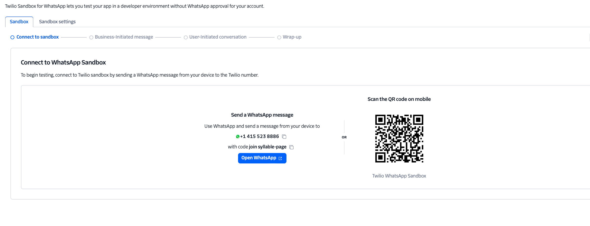

During development, the Twilio WhatsApp Sandbox (`+1 415 523 8886`) allows testing without a fully approved WhatsApp Business Account.

---

## Supabase Edge Functions

### `twilio-webhook`
Receives all inbound WhatsApp messages from Twilio. Responsible for:
- Upserting the customer record (by `whatsapp_phone`)
- Deduplicating messages by `twilio_sid`
- Storing the inbound message in the `messages` table
- Forwarding the payload to n8n for AI processing

### `send-whatsapp`
Outbound message sender. Called by n8n workflows to send:
- Quotation summaries to customers
- Invoice PDF links via WhatsApp
- Follow-up nudge messages

### `generate-invoice-pdf`
Called by the approval workflow. Responsible for:
- Generating a professional PDF from quotation data using `pdf-lib`
- Uploading the PDF to Supabase Storage
- Returning the public PDF URL for WhatsApp delivery

---

## Google Sheets Sync


The Google Sheets integration gives non-technical sales and finance teams full visibility without needing to open the dashboard.

**What syncs to Google Sheets:**
- Every invoice (number, customer, total, tax, status, due date, PDF URL)
- Quotations and order confirmations
- Product catalog (two-way: edits in Sheets sync back to Supabase)

**How it works:**
- n8n Google Sheets node appends or updates rows after every workflow execution
- `sheet_sync_log` table in Supabase tracks last sync timestamps and row hashes to prevent duplicate writes

---

## How to Run

### Prerequisites
- Node.js 18+
- Supabase CLI
- n8n Cloud account (or self-hosted)
- Twilio account with WhatsApp Business sender approved
- Google Cloud project with Sheets API enabled

### 1. Clone the Repository
```bash
git clone https://github.com/your-username/orderpilot.git
cd orderpilot
```

### 2. Install Dependencies
```bash
npm install
```

### 3. Set Up Supabase
```bash
supabase login
supabase link --project-ref ouidhjemurwpcftrobbg
supabase db push
```

### 4. Deploy Edge Functions
```bash
supabase functions deploy twilio-webhook
supabase functions deploy send-whatsapp
supabase functions deploy generate-invoice-pdf
```

### 5. Configure Environment Variables
Copy `.env.example` to `.env` and fill in all values (see below).

### 6. Set Twilio Webhook URL
In Twilio → Messaging → WhatsApp Senders → Edit Sender:
```
Webhook URL: https://ouidhjemurwpcftrobbg.supabase.co/functions/v1/twilio-webhook
```

### 7. Import n8n Workflows
Import the three workflow JSON files from `/n8n-workflows/` into your n8n instance and activate them.

### 8. Start the Dashboard
```bash
npm run dev
```

---

## Environment Variables

```env
# Supabase
VITE_SUPABASE_URL=https://ouidhjemurwpcftrobbg.supabase.co
VITE_SUPABASE_ANON_KEY=your_anon_key
SUPABASE_SERVICE_ROLE_KEY=your_service_role_key

# Twilio
TWILIO_ACCOUNT_SID=your_account_sid
TWILIO_AUTH_TOKEN=your_auth_token
TWILIO_WHATSAPP_FROM=whatsapp:+919631692205

# AI
GEMINI_API_KEY=your_gemini_api_key
OPENAI_API_KEY=your_openai_api_key

# n8n
N8N_WEBHOOK_URL=your_n8n_intake_webhook_url
VITE_N8N_APPROVAL_WEBHOOK_URL=your_n8n_approval_webhook_url

# Google Sheets
GOOGLE_SHEETS_SERVICE_ACCOUNT_KEY=your_service_account_json
GOOGLE_SHEETS_SPREADSHEET_ID=your_spreadsheet_id
```

---

## Project Structure

```
orderpilot/
├── src/
│   ├── pages/
│   │   ├── Inbox.tsx
│   │   ├── Quotations.tsx
│   │   ├── Customers.tsx
│   │   ├── Products.tsx
│   │   ├── Invoices.tsx
│   │   ├── FollowUps.tsx
│   │   └── Analytics.tsx
│   ├── components/
│   └── lib/
│       └── supabase.ts
├── supabase/
│   ├── functions/
│   │   ├── twilio-webhook/
│   │   ├── send-whatsapp/
│   │   └── generate-invoice-pdf/
│   └── migrations/
├── n8n-workflows/
│   ├── intake-workflow.json
│   ├── approval-workflow.json
│   └── followup-workflow.json
├── screenshots/
└── README.md
```

---

## Final Goal

> **OrderPilot is an AI Sales Operating System for WhatsApp-based businesses.**

It automates the full sales lifecycle:
- **Order capture** from WhatsApp text and voice notes
- **AI extraction** of products, quantities, and delivery details
- **Instant quotation** generation priced from a live catalog
- **One-click invoice** delivery as a PDF over WhatsApp
- **Automated follow-ups** for unapproved quotes and overdue payments
- **Google Sheets** as a first-class workspace for non-technical teams
- **Real-time analytics** on revenue, orders, and pipeline health

---

*Built with Supabase · Twilio · n8n · Gemini AI · React · Google Sheets*
